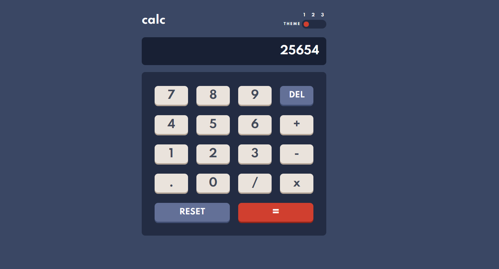

# Todo App

## Description

This a basic Calculator App where people can do the following things:

- Perform mathematical operations like addition, subtraction, multiplication and division
- Adjust the color theme based on their preference

If you want to test it in real time: https://alexc01.github.io/Calculator_App/

## Built with

- Semantic HTML5
- CSS
- Javascript
